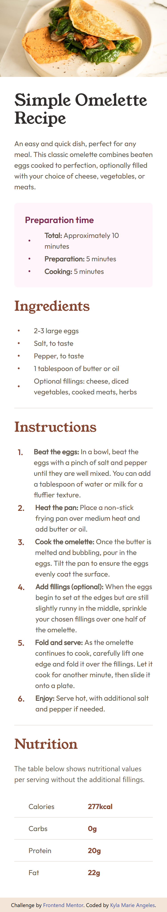
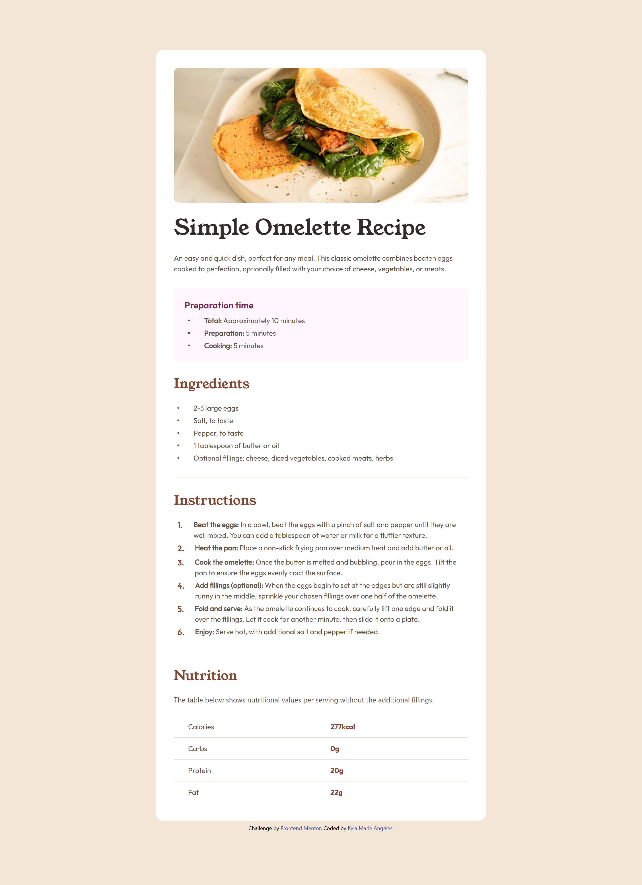

# Frontend Mentor - Recipe page solution

This is a solution to the [Recipe page challenge on Frontend Mentor](https://www.frontendmentor.io/challenges/recipe-page-KiTsR8QQKm). Frontend Mentor challenges help you improve your coding skills by building realistic projects. 

## Table of contents

- [Overview](#overview)
- [My process](#my-process)
  - [Built with](#built-with)
  - [What I learned](#what-i-learned)
  - [Continued development](#continued-development)
- [Author](#author)

## Overview

This project is a solution to the Recipe Page challenge on Frontend Mentor. The goal was to create a visually appealing, responsive recipe page while applying best practices in semantic HTML.

- Live Demo
[View the Live Site](https://keilalily.github.io/fm-recipe-page/)

- Mobile: 375px

- Desktop: 1440px

## My Process

### Built with

- Semantic HTML5 markup
- Tailwind CSS

### What I learned

Working on this challenge helped me practice and improve:
- Writing semantic and accessible HTML
- Using Tailwind CSS utility classes to build responsive layouts
- Creating custom Tailwind configurations, such as extending themes for breakpoints and customizing fonts and colors
- Creating reusable styles for a component

### Continued development

In future projects, I want to continue building my Tailwind CSS skills. This challenge helped me feel more confident using utility classes for layout and spacing, but I’d like to go further by:
- Structuring more complex, scalable layouts
- Taking full advantage of Tailwind’s responsive design utilities
- Improving the consistency and maintainability of utility-first CSS in larger projects

## Author

- Frontend Mentor - [@keilalily](https://www.frontendmentor.io/profile/keilalily)